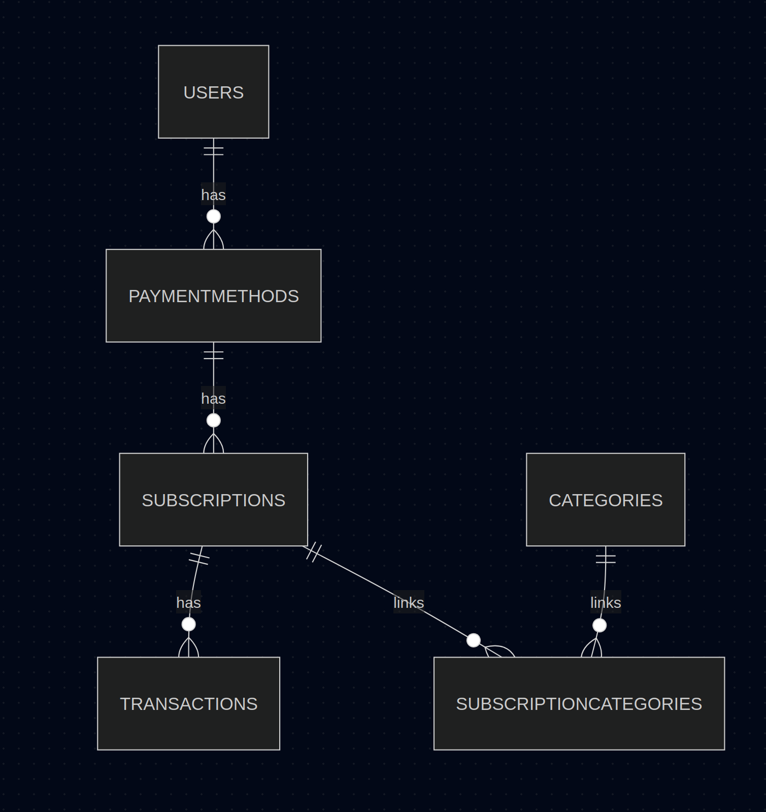

# Subscription Tracker

## Description
A MySQL + Python CLI app to track subscriptions, payments, and spending.

## Features
- Add, update, delete subscriptions
- Track transactions
- Filter subscriptions
- Category system

## Setup
1. Install MySQL
2. Run schema.sql
3. Run data.sql
4. pip install -r requirements.txt
5. python/python3 main.py

## Tables
- Users: stores user info
- PaymentMethods: cards
- Subscriptions: services
- Transactions: payments history
- Categories: grouping
- SubscriptionCategories: M:N relation

## Reflection
In the beginning I messed up with punctuation marks and it took really long time to figure out. The Challeging part was writing the main app and make it wise and clear.

## ERD

## Relationships
- Users → PaymentMethods (1:M) 
- PaymentMethods → Subscriptions (1:M) 
- Subscriptions → Transactions (1:M)
- Subscriptions ↔ Categories (M:N)
